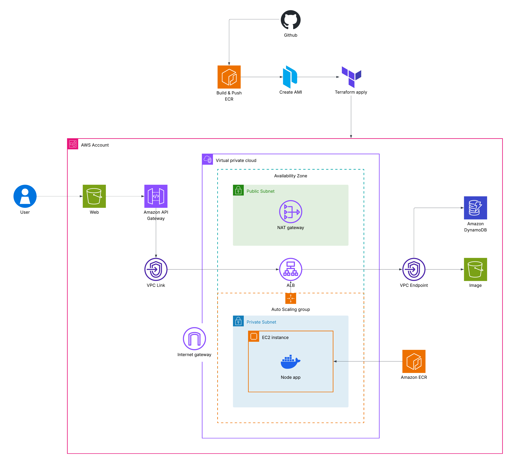

# Kua-Glang

**Kua-Glang** is a community-driven food sharing platform dedicated to reducing food waste and fostering local connections. The platform allows users to share surplus food, track food inventory, and engage with a community of environmentally-conscious individuals.

## 🏗️ System Architecture



Kua-Glang is built with a highly available and scalable cloud-native architecture on AWS, designed for security and reliability.

### 🔌 API Infrastructure
- **Amazon API Gateway**: Acts as the primary entry point for all client requests, providing a secure and managed interface for the backend services.
- **VPC Link**: Securely routes traffic from the public API Gateway to the internal Application Load Balancer (ALB) without exposing the backend directly to the public internet.

### 🌐 Compute & Load Balancing
- **Application Load Balancer (ALB)**: Distributes incoming traffic across multiple instances of the Express.js backend within private subnets across multiple Availability Zones (AZs).
- **Auto Scaling Group (ASG)**: Automatically manages the backend server cluster, scaling instances based on demand and ensuring high availability.
- **VPC Isolation**: The architecture follows a strict network hierarchy with public subnets for entry points and private subnets for critical backend services and databases.

### 🗄️ Storage & Data
- **Amazon DynamoDB**: A fully managed NoSQL database for fast and predictable performance with seamless scalability for user profiles, posts, and inventory data.
- **Amazon S3**: High-durability object storage for user-uploaded food images, post attachments, and Terraform state management.

## 🌟 Key Features

- **Food Sharing Marketplace**: Create and discover share posts for surplus food in your area.
- **Smart Inventory Management**: Organizable folders and food tracking to monitor expiration dates and reduce household waste.
- **Community Engagement**: Follow other users, like and comment on posts, and build a network of food sharers.
- **Gamification & Quests**: Complete quests and climb the leaderboard to earn recognition for your contributions to waste reduction.
- **Real-time Notifications**: Get notified about interests in your shared items and community updates.
- **Profile & Statistics**: Track your impact with personal statistics on food shared and waste prevented.

## 🛠️ Tech Stack

### Frontend
- **Framework**: React
- **Styling**: Tailwind CSS
- **Icons**: Lucide React & React Icons
- **Routing**: React Router DOM

### Backend
- **Runtime**: Node.js
- **Framework**: Express.js
- **Database**: Amazon DynamoDB
- **Storage**: Amazon S3

### Infrastructure & DevOps
- **Provisioning**: Terraform
- **Image Building**: Packer
- **Containerization**: Docker
- **CI/CD**: GitHub Actions

## 📂 Project Structure

```text
├── backend/             # Express.js API
│   ├── src/
│   │   ├── controllers/ # Business logic (Auth, Food, Post, Share, Rank)
│   │   ├── routes/      # API endpoints
│   │   └── utils/       # Database & AWS configurations
├── frontend/            # React application
│   ├── src/
│   │   ├── components/  # Modular UI components
│   │   ├── pages/       # Page-level components
│   │   └── services/    # API integration logic
├── terraform/           # Infrastructure as Code (AWS)
├── packer/              # Server image configuration
└── docker-compose.yml   # Local development orchestration
```

## ☁️ Deployment

### Infrastructure
The project uses **Terraform** to manage AWS resources. Navigate to terraform/live/prod to initialize and apply changes:
```bash
terraform init
terraform apply
```

### Server Image
**Packer** is used to create pre-configured AMIs for the backend:
```bash
cd packer
packer build backend.pkr.hcl
```
